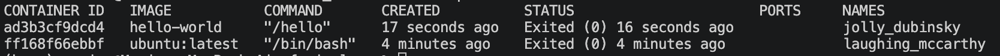

# In-Class Activity: Jupyter Notebooks & Docker Basics

**Assumes:** No prior experience with Docker. Comfort with basic command line navigation (`cd`, `ls`, `mkdir`) and a working Python installation.


## Why we're doing this

Today has two goals that will both pay off next week:

1. Get comfortable keeping a running, shareable record of what you did (code) and what happened (results, fitures, notes) — that's what the Jupyter Notebooks are great for.
2. Get Docker installed, verified, and understood at a basic level, so that you will feel comfortable using Docker for next steps in fMRI analyses.


---

## Part 1: Install Jupyter, then connect your existing `fmri_class` environment as a kernel

We'll use a notebook today to log commands and output as we go, rather than just typing into a bare terminal. This is good practice for keeping a reproducible record of technical work.

You should already have an `fmri_class` conda environment with `nilearn` and `matplotlib` installed from before class. Today we'll install Jupyter Lab itself, then connect that existing environment to it so you can use `nilearn` inside a notebook.

### Step 1: Install Jupyter Lab on your machine

If you haven't used Jupyter before, install it now. This gets you a general-purpose Jupyter Lab you can launch from anywhere. Think of it as the "app" that opens and runs Jupyter notebooks, separate from any particular project's packages.

```
conda install -n base -c conda-forge jupyterlab
```

Confirm it installed correctly:
```
jupyter lab --version
```
You should see a version number printed (e.g., `4.x.x`). If you get a "command not found" error, close and reopen your terminal (this refreshes your PATH) and try again.

### Step 2: Add `ipykernel` to your existing `fmri_class` environment

Jupyter itself doesn't automatically know about `fmri_class`. We need to add one more package to that environment so it can register itself as a kernel. Activate the environment you already created:
```
conda activate fmri_class
```
Your terminal prompt should now show `(fmri_class)` at the start of the line. With the environment active, install `ipykernel`:
```
conda install -c conda-forge ipykernel
```

### Step 3: Register `fmri_class` as a Jupyter kernel

This is the step that connects your environment to the Jupyter Lab you installed in Step 1. With `fmri_class` still active, run:
```
python -m ipykernel install --user --name fmri_class --display-name "Python (fmri_class)"
```
This registers a kernel spec that Jupyter Lab will list as a selectable option.

Now deactivate your conda environment

```
conda deactivate
```

### Step 4: Launch Jupyter Lab and select your kernel

1. Launch Jupyter Lab the normal way:
   ```
   jupyter lab
   ```
2. Create a new notebook. When prompted to choose a kernel (or via the kernel picker in the top-right corner), select **Python (fmri_class)** — not the default Python 3 kernel. Now, you should be able to use all the libraries installed in the `fmri_class` conda environment from Jupyter Notebook

3. Save the notebook as `demo_notebook.ipynb` in your folder for this course. 
4. In the first cell, make it a **Markdown** cell (not code) and write a short title and today's date. Run the cell (Shift+Enter). Notice it renders as formatted text instead of code.


5. In the next cell, switch to a **code** cell and confirm you're in the right environment:
   ```python
   import nilearn
   import matplotlib
   print(nilearn.__version__, matplotlib.__version__)
   ```
   If this runs without an error, `fmri_class` is correctly connected to Jupyter.
6. Save the notebook (Cmd/Ctrl+S).

7. See what happens if you switch your kernel. Do you get a different nilearn version? Any nilearn version at all?

8. Jupyter Notebooks are good for inspecting tabular dataframes using the `pandas` packages (similar to data frames in R). Run the code below in a chunk to see how you can show parts of dataframes inline in the notebook with the `head()` function

```python
import pandas as pd
iris_df = pd.read_csv("https://raw.githubusercontent.com/uiuc-cse/data-fa14/gh-pages/data/iris.csv")
iris_df.head()
```

9. Test out making plots directly in your notebook by using this below code to plot a sine wave

```python
import numpy as np
import matplotlib.pyplot as plt

x = np.linspace(0, 4 * np.pi, 500)
y = np.sin(x)

plt.plot(x, y)
plt.xlabel("x")
plt.ylabel("sin(x)")
plt.title("Sine wave")
plt.grid(True)
plt.show()
```

10. Shut down the Jupyter Notebook by closing the window you had open. Back at the terminal, you can use `control+c` to shut down the process that launched the Jupyter server. You might see the question *"Shut down this Jupyter server (y/[n])? y"()*, and you can choose y if you're done working and have saved your notebook file. 

## Part 2: Install Docker Desktop

1. Go to [https://www.docker.com/products/docker-desktop/](https://www.docker.com/products/docker-desktop/)
2. Download the version for your operating system:
   - **Mac:** choose Apple Silicon (M1/M2/M3/M4) or Intel chip, depending on your machine. (Check via Apple menu → About This Mac.)
   - **Windows:** download the Windows installer (you may be prompted to enable WSL2 – follow the on-screen instructions if so).
3. Run the installer and follow the prompts. You do not need a paid account. A free personal account is fine, or you can skip sign-in for personal, non-commercial use.
4. Once installed, launch Docker Desktop. You should see a small whale icon appear in your menu bar (Mac) or system tray (Windows), indicating Docker is running in the background. **Docker Desktop needs to stay open/running** any time you use Docker commands in the terminal.

---

## Part 3: Verify Docker works from the terminal

Open your terminal and run:
```
docker --version
```
You should see a version number printed (e.g., `Docker version 27.x.x`). If you get a "command not found" error, Docker Desktop is either not installed correctly or not running — check the whale icon.

Next, run:
```
docker run hello-world
```
This downloads a tiny test image and runs it. You should see a message starting with "Hello from Docker!" confirming your installation can pull and run containers successfully.


## Part 4: Vocabulary + basic commands

| Term | Meaning |
|---|---|
| **Image** | A saved, reusable snapshot of a complete software environment. Think of it as a blueprint. |
| **Container** | A running instance of an image. You can start, stop, and delete containers without affecting the underlying image. |
| **Docker Hub** | An online registry (like a library) where people share pre-built images publicly — similar in spirit to GitHub, but for container images instead of code. |

Try these commands now (some may show empty/near-empty results — that's expected):
```
docker images
docker ps
docker ps -a
```
- `docker images` lists images you've downloaded (you should see `hello-world` listed).
- `docker ps` lists **currently running** containers.
- `docker ps -a` lists **all** containers, including stopped ones.

---

## Part 5: Pull and run a bigger image interactively — what does "inside the container" really mean?

Let's practice on a small general-purpose image and really dig into what it means for a container to be its own isolated little computer.

1. Pull and start the image. 

   ```
   docker pull ubuntu:latest
   docker run -it ubuntu:latest /bin/bash
   ```
   Your prompt should change (something like `root@<random-id>:/#`) — this means you're **inside** the container now, not on your own laptop.

2. While inside, create a file that exists only in this container:
   ```
   echo "hello from inside the container" > /root/inside_container.txt
   ls /root
   cat /root/inside_container.txt
   ```

   You should be able to see the file and print out its contents with `cat`

3. Leave the container, but don't delete it:
   ```
   exit
   ```

4. Now, back on your own laptop, go hunting for that file. Try looking in your home directory, Downloads, wherever seems reasonable:
   ```
   ls ~
   find ~ -name "inside_container.txt"
   ```
   You should come up empty. The file is real, and it still exists, just not anywhere on your laptop's filesystem. It's sitting inside that container's own private filesystem.

5. Prove the container (and the file) still exist, even though you exited. Since we skipped `--rm`, the container is stopped but not deleted:
   ```
   docker ps -a
   ```

   

   You should see something like this. Find your container in the list (should be the only one running now) and note its container ID or auto-generated name.

6. Start it back up and peek inside without opening a full interactive shell, using `docker exec`. The `exec` command runs a command from the Docker container but doesnt create an interactive session. 
   ```
   docker start <container_id_or_name>
   docker exec -it <container_id_or_name> cat /root/inside_container.txt
   ```
   The file is still there, exactly where you left it. This is proof that a container's filesystem persists across stop/start, but lives entirely separate from your laptop.

7. Now clean up. Since this container isn't attached to anything you need, delete it:
   ```
   docker rm <container_id_or_name>
   ```

   Note, you may see something like "Error response from daemon: cannot remove container "/laughing_mccarthy": container is running: stop the container before removing or force remove". This is because docker can't delete a container that is currently **running**. If you see this, run `docker stop <container_id_or_name>` to stop your container first, then retry removing it. 

   That file is now gone permanently, since it only ever existed inside that one container's storage, and deleting the container took it with it. The `ubuntu` **image** itself is untouched; confirm with:
   ```
   docker images
   ```

   But, if you run `docker ps -a` again, you should see that the particular **container** you ran is gone.

**Discuss with a partner and write down responses**
- What's the difference between "deleting the container" and "deleting the image"?
- Why couldn't you find `inside_container.txt` from your laptop, even while the container was running?
---

